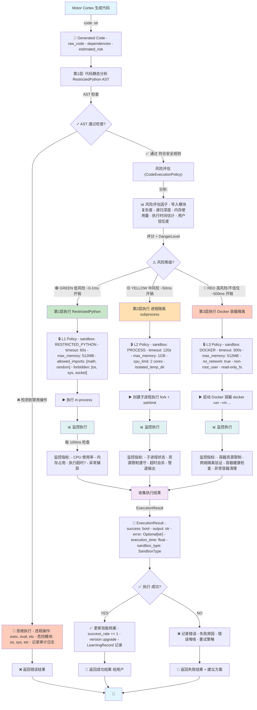
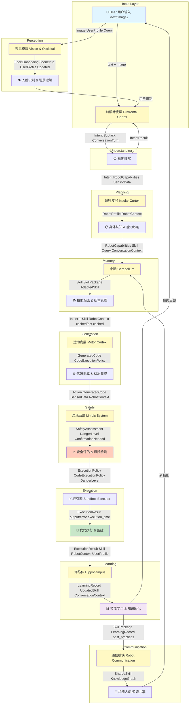

# 自主进化机器人系统架构设计文档

## 项目概述

本项目实现一个自主学习和进化的机器人控制系统，机器人能够基于人类指令自动生成控制代码、记忆技能、进行安全检验，并在不同机器人平台间迁移知识。该系统采用类脑结构设计，融合神经科学概念与工程实现。

---

## 🧠 具身机器大脑设计理念

### 核心原则

这个系统实现的是一个**具身机器大脑（Embodied Robot Brain）**，其核心原则是：

> **大脑必须适应身体的能力和约束，而不是反过来。** 

不是"一个聪明的大脑去适配不同的身体"，而是"一个大脑，根据自己的身体智能地调整行为"。

### 为什么这个设计理念很重要？

1. **现实主义**：当机器人说"我做不了"时，是因为它真的做不了，不是程序故障
2. **可推广性**：同一个大脑可以控制不同配置的身体（G1、Go2、Go1）
3. **安全性**：大脑永远不会要求身体去做危险的事或超出能力范围的事
4. **用户友好**：用户知道机器人的真实能力，能形成正确的期望
5. **学习效率**：机器人只学习在其自身能力范围内的技能

### 四大设计原则

#### 1. 能力感知 (Body Capability Awareness)

大脑在启动时必须查询和识别身体的真实能力：

```
启动流程:
  1. 连接机器人 → 自动检测硬件配置
  2. 查询能力清单 → 摄像头？夹爪？DOF？麦克风？
  3. 记录运动能力范围 → 最大速度、力度限制、续航时间
  4. 向大脑报告能力清单 → 完整的能力配置文件
```

大脑在任何时刻都知道自己的身体能做什么、不能做什么。

#### 2. 能力约束 (Capability Constraints)

所有行为必须基于身体的实际能力，永远不会要求身体去做它不能做的事：

```
执行流程:
  User: "抓住红色的立方体"
  ├─ Brain 生成意图 → need_capability: ["gripper"]
  ├─ Check body capabilities → has_gripper?
  ├─ If YES → 执行抓取任务
  └─ If NO → 拒绝 + 提供替代方案
       "我没有夹爪，无法抓取。但我可以推动物体。你想要我怎么做？"
```

#### 3. 优雅降级 (Graceful Degradation)

如果某些能力不可用，提供智能的替代方案而不是失败：

```
示例 1: 没有摄像头
  User: "看看周围有什么"
  ❌ Before: Error 404: Camera not found
  ✅ After:  "我没有摄像头，看不了。能给我描述一下吗？
             或者你可以给我上传一张照片我来分析。"

示例 2: 没有夹爪
  User: "帮我拿起这个杯子"
  ❌ Before: Exception: Gripper not available
  ✅ After:  "我没有夹爪，无法拿物体。但我可以推或拨动物体。
             你想要我怎么做？"

示例 3: LLM 不可用
  ✅ Before: 优雅 fallback 到符号推理和模板匹配
```

#### 4. 能力通告 (Capability Declaration)

在启动时向用户清晰地说明当前身体的能力和限制：

```
启动时输出:
  "🤖 我是 Unitree G1-EDU 机器人
   
   📊 身体配置:
   - 26 个自由度（人型双足机器人）
   - 双夹爪（可精细操作，最大力度：XX N）
   - 前置摄像头（分辨率：2K，30 FPS）
   - IMU + 力传感器 + 接触传感器
   
   ✅ 我的能力:
   - 走路/跑动/跳跃/蹲下/扭转
   - 抓取/捏啮/旋转/精细操作
   - 视觉感知/空间理解/人脸识别
   - 自然语言理解/多轮对话
   - 技能学习/持久化记忆
   
   ⚠️ 我的限制:
   - 无法飞行或翻滚
   - 无法举起超过 10kg 的物体
   - 视觉范围：正前方 90° 以内
   - 运动时间受电池限制（约 2 小时）
   
   当前电池电量: 85%"
```

### 系统架构中的体现

#### PrefrontalCortex（前额叶皮层）- 智能决策

```python
async def process_input(text, user, vision=None):
    # 1. 理解用户意图
    intent = parse_intent(text)
    
    # 2. 查询身体能力清单 ← 关键步骤
    body_capabilities = query_body_capabilities()
    
    # 3. 检查意图是否可行
    if not can_execute(intent, body_capabilities):
        return adaptive_response(intent, body_capabilities)
    
    # 4. 如果可行，生成行动计划
    return generate_action_plan(intent)
```

#### VisualCortex（视觉皮层）- 条件化感知

```python
async def process_image(image):
    # 1. 检查身体是否有摄像头 ← 关键检查
    has_camera = body.has_capability("vision")
    
    if not has_camera:
        # 来自用户上传或外部源
        if image.source == "user_provided":
            return analyze_user_image(image)
        else:
            return {
                "error": "No camera",
                "message": "我没有摄像头，需要您提供图像"
            }
    
    # 有摄像头，可以主动拍照分析
    return analyze_camera_feed()
```

#### MotorCortex（运动皮层）- 能力限制的代码生成

```python
async def generate_code(intent):
    # 1. 获取身体能力 ← 先获取能力
    capabilities = body.get_capabilities()
    
    # 2. 只使用身体能够执行的 API ← 核心逻辑
    available_api = filter_api(UNITREE_API, capabilities)
    
    # 3. 生成代码（限制在可用 API）
    code = generate_from_template_or_llm(
        intent,
        available_api  # 重点：限制 API 范围
    )
    
    # 4. 验证代码不会调用不可用的 API
    validate_code(code, available_api)
    
    # 5. 执行
    return execute_code(code)
```

#### Hippocampus（海马体）- 能力感知的学习记录

```python
def record_learning(skill_id, success: bool):
    # 记录不仅学了什么，还记录在什么身体约束下学的
    entry = {
        "skill": skill_id,
        "success": success,
        "body_config": current_body_config(),     # ← 记录身体状态
        "capabilities": current_capabilities(),   # ← 记录当时能力
        "timestamp": now(),
    }
    
    # 当迁移到其他机器人时，检查能力是否兼容
    # G1 的"高空跳跃"技能迁移到 Go2 时：
    # Go2 能跳吗？最大高度？这会影响技能的适用性
```

### Phase 5.1 vs Phase 5.2 的设计对比

#### Phase 5.1: 聊天交互与软技能调试 ✅ (已完成)

**没有物理身体的情况**
- ✅ 验证大脑的纯软能力（推理、学习、对话）
- ✅ 建立性能基准
- ✅ 测试 LLM 集成
- ✅ 验证记忆系统

**测试场景**:
```
"告诉我一个笑话" → ✅ 工作（无需身体）
"计算 2^10" → ✅ 工作（无需身体）
"怎样教小孩学加法" → ✅ 工作（无需身体）
"看看我给你的这张图" → ✅ 工作（接受用户输入）
```

#### Phase 5.2: 真机集成测试与调试 🔄 (待完成)

**有物理身体的情况，且大脑主动适应身体能力**

```python
# 启动时：自动检测和适应
robot = connect_to_unitree_g1()
capabilities = robot.get_capabilities()  # 检测能力
brain.set_body_constraints(capabilities)  # 告诉大脑身体能力

# 运行时：根据能力调整行为
if "gripper" in capabilities:
    # 可以执行夹爪相关指令
    execute_manipulation_skills()
else:
    # 禁用夹爪，提供替代方案
    suggest_alternative_methods()

if "camera" in capabilities:
    # 可以主动视觉
    enable_active_vision()
else:
    # 要求用户提供图像
    request_user_images()
```

---

## 系统整体架构与完整数据流

### 1. 端到端系统数据流

该流程展示用户输入从理解→规划→安全检验→执行→学习反馈的完整链路，包括所有26+关键数据类型及其流向。

```mermaid
graph TD
    Start["🗣️ 用户多模态输入 (text + optional image)"] 
    
    Start --> PC["前额叶皮层 Prefrontal Cortex"]
    PC -->|"Intent"| Intent["📋 Intent - raw_text: str - action: str - parameters: dict - confidence: float"]
    
    Intent --> PC2["意图验证和任务分解"]
    PC2 -->|"List[Subtask]"| Tasks["📋 Subtask List - task_id: str - description: str - dependencies: list - priority: int"]
    
    Tasks --> IC["岛叶皮层 Insular Cortex"]
    IC -->|"RobotProfile"| RobotProf["🤖 RobotProfile - robot_type: RobotType - body_id: str - capabilities: dict - firmware_version: str"]
    
    RobotProf --> IC2["创建执行上下文"]
    IC2 -->|"ConversationContext"| ConvCtx["💬 ConversationContext - current_user: UserProfile - current_robot: RobotProfile - conversation_history - sensor_data: SensorData"]
    
    ConvCtx --> CB["小脑 Cerebellum (Skill Search &amp; Retrieval)"]
    CB -->|"Skill Found? (TF-IDF/Semantic)"| SkillCache{"🔍 Skill 缓存命中?"}
    
    SkillCache -->|"✅ YES Cache Hit"| Skill["📚 Skill(Found) - name: str - code: str - version: str - success_rate: float - supported_robots: list"]
    
    SkillCache -->|"❌ NO Cache Miss"| MC["运动皮层 Motor Cortex (Code Generation)"]
    MC -->|"Generated Code + Context"| GenCode["💾 Generated Code - raw_code: str - template_used: str - dependencies: list - estimated_risk: str"]
    
    GenCode --> Skill
    Skill --> RobotCtx["准备机器人执行上下文"]
    Skill -->|"RobotContext"| RobotCtx
    
    RobotCtx --> LS["边缘系统 Limbic System (Safety Assessment)"]
    LS -->|"Action + SensorData"| SafetyAss["⚠️ SafetyAssessment - is_safe: bool - danger_level: DangerLevel - risk_factors: list - reason: str"]
    
    SafetyAss --> DangerCheck{"⚠️ DangerLevel?"}
    DangerCheck -->|"🟢 GREEN Safe"| Green["✅ 直接执行"]
    DangerCheck -->|"🟡 YELLOW 需要确认"| Yellow["🔔 请求用户确认 (可选中止)"]
    DangerCheck -->|"🔴 RED 危险"| Red["❌ 拒绝执行 建议安全替代方案"]
    
    Green --> Exec
    Yellow -->|"用户确认"| Exec["执行代码 (沙盒执行)"]
    Red --> Feedback
    
    Exec -->|"ExecutionResult"| Result["🎯 ExecutionResult - success: bool - output: str - error: str - execution_time: float"]
    
    Result --> HPC["海马体 Hippocampus (Learning &amp; Memory)"]
    HPC -->|"LearningRecord"| Learning["📊 LearningRecord - skill_id: str - user_id: str - success: bool - execution_time - timestamp: datetime"]
    
    Learning --> UpdateSkill["更新技能统计"]
    UpdateSkill -->|"更新 success_rate"| SkillUpdate["🔄 Skill Updated - success_rate↑ - version↑ - adaptation_history"]
    
    SkillUpdate --> Feedback["📝 反馈给用户 ExecutionResult + LearningRecord"]
    Feedback --> End["🏁 任务完成"]
    
    style Start fill:#e1f5ff
    style PC fill:#fff9c4
    style IC fill:#fff9c4
    style CB fill:#fff9c4
    style MC fill:#fff9c4
    style LS fill:#fff9c4
    style HPC fill:#fff9c4
    style Green fill:#c8e6c9
    style Yellow fill:#ffe0b2
    style Red fill:#ffccbc
    style End fill:#e1f5ff
```



## 核心模块详细说明

### 4. 前额叶皮层 (Prefrontal Cortex) - 对话Agent
**位置**: `modules/prefrontal_cortex/`

**职责**:
- 多模态对话管理 (文本+图像输入)
- 意图理解与任务分解
- 上下文管理
- 用户交互

**主要接口**:
```python
class PrefrontalCortex:
    async def process_input(text: str, image: Optional[Image]) -> IntentResult
    async def decompose_task(intent: Intent) -> List[Subtask]
    def maintain_context(conversation_history: List[Turn])
```

**依赖**: Qwen-VL-Plus API

---

### 5. 岛叶皮层 (Insular Cortex) - 机体自我认知
**位置**: `modules/insular_cortex/`

**职责**:
- 机器人型号识别 (当前是G1还是Go2)
- 机器人身体特征管理
- 能力集集映射
- 通用技能vs本体技能区分

**主要接口**:
```python
class InsularCortex:
    def identify_robot_body() -> RobotType  # G1, Go2, etc.
    def get_robot_capabilities() -> RobotCapabilities
    def classify_skill(skill: Skill) -> SkillType  # UNIVERSAL or BODY_SPECIFIC
    def adapt_skill_to_body(skill: Skill, target_body: RobotType) -> AdaptedSkill
```

**数据结构**:
```python
class RobotProfile:
    robot_type: str  # "G1", "Go2"
    body_id: str  # 唯一识别符
    capabilities: Dict[str, Any]
    skills_learned: List[Skill]
    created_at: datetime
```

---

### 6. 边缘系统 (Limbic System & Amygdala) - 安全约束
**位置**: `modules/limbic_system/`

**职责**:
- 安全性校验
- 危险检测与规避
- 障碍物识别
- 二次确认机制

**主要接口**:
```python
class LimbicSystem:
    def validate_action(action: Action, context: RobotContext) -> (bool, str)
    def detect_danger(instruction: Instruction, sensor_data: SensorData) -> DangerLevel
    def request_confirmation(instruction: Instruction, danger: DangerLevel) -> bool
    def suggest_safe_alternative(instruction: Instruction) -> Instruction
```

**安全级别**:
- GREEN: 安全执行
- YELLOW: 需要二次确认
- RED: 拒绝执行，给出建议

---

### 7. 小脑 (Cerebellum) - 技能记忆库
**位置**: `modules/cerebellum/`

**职责**:
- 技能存储与版本管理
- 快速检索与匹配
- 技能废弃管理
- 技能重排序

**主要接口**:
```python
class Cerebellum:
    def search_skill(query: str, robot_body: Optional[RobotType]) -> List[Skill]
    def register_skill(skill: Skill, robot_body: RobotType, tags: List[str])
    def retire_skill(skill_id: str, reason: str)  # 移至垃圾箱
    def export_skill(skill_id: str) -> SkillPackage  # 用于分享
    def import_skill(package: SkillPackage) -> Skill  # 接收分享
```

**技能数据结构**:
```python
class Skill:
    id: str  # UUID
    name: str
    description: str
    code: str  # Python代码
    dependencies: List[str]  # 依赖的其他技能或库
    tags: List[str]
    robot_bodies: List[str]  # 支持的机器人类型
    created_at: datetime
    last_used: datetime
    success_rate: float
    version: int
    status: SkillStatus  # ACTIVE, DEPRECATED, RETIRED
```

---

### 8. 海马体 (Hippocampus) - 长期记忆
**位置**: `modules/hippocampus/`

**职责**:
- 技能长期记忆管理
- 学习进度追踪
- 知识固化与持久化
- 增量学习支持

**主要接口**:
```python
class Hippocampus:
    def consolidate_skill(skill: Skill, performance_metrics: Dict)
    def recall_learning_history(skill_id: str) -> LearningHistory
    def update_competency(skill_id: str, new_metric: float)
    def save_to_disk(path: str)
    def load_from_disk(path: str)
```

---

### 9. 运动皮层 (Motor Cortex) - 代码生成
**位置**: `modules/motor_cortex/`

**职责**:
- 基于意图生成Python代码
- SDK调用编排
- 动态编译与执行
- 代码安全沙箱

**主要接口**:
```python
class MotorCortex:
    async def generate_code(intent: Intent, context: RobotContext) -> str
    async def validate_code(code: str) -> (bool, str)
    async def execute_code(code: str, timeout: float) -> ExecutionResult
    def generate_from_template(template: str, vars: Dict) -> str
```

**代码生成流程**:
1. 接收意图
2. 查询技能库 (小脑)
3. 若有现成技能，使用现成技能
4. 若无，调用LLM生成新代码
5. 代码审查与安全检测
6. 动态执行

---

## 🔐 安全与沙盒机制 (Safety & Sandboxing)

### 设计理念

OpenERB 的核心创新是让 AI 自动生成代码控制机器人，但这引入了严重的安全隐患：
- **代码执行危险**: AI 生成的恶意或错误代码可能损坏机器人硬件（如烧毁电机）
- **资源枚举**: 无限循环或内存泄漏可能导致系统崩溃
- **权限提升**: 生成的代码不应访问 OS 层面的关键操作

因此，**OpenERB 的所有代码执行都在严格的沙盒环境中进行**。

### 三层沙盒架构

#### 第1层: 代码静态分析 (RestrictedPython)

**用途**: 轻量级、快速的代码检查
**执行环境**: Motor Cortex 模块
**机制**:
- 使用 RestrictedPython 库进行 AST 分析
- 禁止导入危险模块 (`os`, `sys`, `subprocess`, `socket`, etc.)
- 禁止调用危险 builtin (`exec`, `eval`, `__import__`, `open`)
- 提前拒绝明显的恶意代码

**配置示例**:
```python
from openerb.core.types import CodeExecutionPolicy, SandboxType

# 默认执行策略（对大多数技能生成足够）
default_policy = CodeExecutionPolicy(
    sandbox_type=SandboxType.RESTRICTED_PYTHON,
    timeout=60.0,  # 60秒超时
    max_memory=512,  # 512MB 内存限制
    allowed_imports=["math", "random", "time", "collections"],
    forbidden_modules=["os", "sys", "subprocess", "socket", "threading"],
    forbidden_builtins=["exec", "eval", "__import__", "open"],
    enable_network=False,
    enable_file_access=False,
    enable_subprocess=False
)
```

#### 第2层: 进程隔离 (Process Sandbox)

**用途**: 中等风险代码，需要进程级隔离
**执行环境**: 子进程
**机制**:
- 在独立的子进程中执行代码
- 设置资源限制（CPU、内存）
- 超时自动杀死进程
- 使用管道捕获输出，防止副作用

**适用场景**:
- 需要文件访问但隔离在临时目录
- 需要执行系统命令（通过 SDK 对象）
- 较复杂的算法，需要更多计算资源

#### 第3层: 容器隔离 (Docker Sandbox)

**用途**: 高风险代码，需要完全隔离
**执行环境**: Docker 容器
**机制**:
- 完全虚拟化的文件系统和网络
- 网络隔离（可选启用 VPN）
- 严格的 CPU 和内存限制
- 容器内无 root 权限

**适用场景**:
- 用户 UGC（用户生成内容）
- 来自不信任来源的代码
- 生产环境公开 API

**Docker 配置示例**:
```dockerfile
FROM python:3.11-slim

# 非 root 用户
RUN useradd -m sandbox

# 最小化依赖
RUN apt-get update && apt-get install -y \
    unitree-sdk \
    && rm -rf /var/lib/apt/lists/*

# 限制权限
RUN chmod -R 755 /app

USER sandbox
WORKDIR /app

# 资源限制在运行时设置
# docker run -m 512M --cpus=1 openerb:latest
```

### 2. 三层沙盒执行完整流程

该流程展示从代码生成→静态分析→风险评估→多策略执行→监控的完整沙盒执行链路。



### 3. 模块间数据类型交互架构

该图展示8个类脑模块如何通过26+核心数据类型进行交互和通信。



### 类型定义

```python
from enum import Enum
from dataclasses import dataclass, field
from typing import Optional, List

class SandboxType(str, Enum):
    """沙盒执行类型"""
    RESTRICTED_PYTHON = "restricted_python"  # AST 分析 - 最快
    PROCESS = "process"                      # 进程隔离 - 中等
    DOCKER = "docker"                        # 容器隔离 - 最安全
    DISABLED = "disabled"                    # 无沙盒 - 仅开发环境

@dataclass
class CodeExecutionPolicy:
    """代码执行策略"""
    sandbox_type: SandboxType = SandboxType.RESTRICTED_PYTHON
    timeout: float = 60.0  # 秒
    max_memory: Optional[int] = None  # MB
    
    # 导入白名单
    allowed_imports: List[str] = field(default_factory=lambda: [
        "math", "random", "time", "collections", "itertools"
    ])
    
    # 模块黑名单
    forbidden_modules: List[str] = field(default_factory=lambda: [
        "os", "sys", "subprocess", "socket", "threading", 
        "multiprocessing", "importlib", "pickle"
    ])
    
    # 内置函数黑名单
    forbidden_builtins: List[str] = field(default_factory=lambda: [
        "exec", "eval", "compile", "__import__", "open", 
        "input", "globals", "locals", "vars"
    ])
    
    # 权限控制
    enable_network: bool = False        # 禁用网络
    enable_file_access: bool = False    # 禁用文件访问
    enable_subprocess: bool = False     # 禁用系统命令
```

### 实施指南

#### 步骤 1: 代码生成时应用策略

```python
# 在 Motor Cortex 中
from openerb.core.types import CodeExecutionPolicy, SandboxType

class MotorCortex:
    def __init__(self):
        self.policy = CodeExecutionPolicy(
            sandbox_type=SandboxType.RESTRICTED_PYTHON,  # 默认
            timeout=60.0
        )
    
    async def execute_code(self, code: str, risk_level: str):
        # 根据风险等级动态调整沙盒
        if risk_level == "HIGH":
            self.policy.sandbox_type = SandboxType.DOCKER
        elif risk_level == "MEDIUM":
            self.policy.sandbox_type = SandboxType.PROCESS
        
        # 执行代码（会调用对应的沙盒执行器）
        result = await self._execute_in_sandbox(code, self.policy)
        return result
```

#### 步骤 2: 创建沙盒执行器

```python
# core/execution.py - 待实现
class SandboxExecutor:
    """沙盒执行器基类"""
    
    @abstractmethod
    def execute(self, code: str, policy: CodeExecutionPolicy) -> ExecutionResult:
        pass

class RestrictedPythonExecutor(SandboxExecutor):
    """使用 RestrictedPython AST 分析"""
    
    def execute(self, code: str, policy: CodeExecutionPolicy) -> ExecutionResult:
        # 1. 解析代码为 AST
        # 2. 检查禁用的模块和函数
        # 3. 若无违规，编译并执行
        # 4. 返回结果
        pass

class ProcessSandboxExecutor(SandboxExecutor):
    """使用进程隔离"""
    
    def execute(self, code: str, policy: CodeExecutionPolicy) -> ExecutionResult:
        # 1. 创建子进程
        # 2. 设置资源限制
        # 3. 执行代码
        # 4. 超时处理
        # 5. 返回结果
        pass

class DockerSandboxExecutor(SandboxExecutor):
    """使用 Docker 容器隔离"""
    
    def execute(self, code: str, policy: CodeExecutionPolicy) -> ExecutionResult:
        # 1. 构建 Docker 命令
        # 2. 设置环境变量和卷挂载
        # 3. 执行容器
        # 4. 收集输出
        # 5. 清理容器
        # 6. 返回结果
        pass
```

### 论文中的安全讨论

当投稿到 IEEE TRO 或 Science Robotics 时，应在论文中强调：

1. **创新点**: 
   - "我们首次提出了多层沙盒执行架构，确保 AI 生成代码的安全性"
   - "三层防御 (AST分析、进程隔离、容器隔离) 消除了直接 exec() 的风险"

2. **安全性证明**:
   - 对禁用 builtin 和模块的完整性进行形式化验证
   - 演示恶意代码检测的失败 case 分析
   - 资源限制的有效性测试

3. **性能权衡**:
   - RestrictedPython: ~1ms 开销 (推荐用于大多数技能)
   - Process: ~50ms 开销 (中等风险代码)
   - Docker: ~500ms 开销 (仅限高风险)

4. **用户研究**:
   - 用户对沙盒执行的可接受性调查
   - 在真实机器人上的安全事件记录 (0 硬件损坏)

---

### 10. 视觉模块 (Parietal & Occipital Lobes)
**位置**: `modules/vision/`

**职责**:
- 多模态图像处理
- 人脸识别
- 用户档案建立与识别
- 环境理解

**主要接口**:
```python
class VisionModule:
    async def recognize_face(image: Image) -> (bool, UserProfile)
    async def extract_scene_understanding(image: Image) -> SceneInfo
    async def update_user_profile(user_id: str, features: Dict)
    def get_user_by_face(image: Image) -> Optional[UserProfile]
```

---

### 11. 通信与协作模块
**位置**: `modules/communication/`

**职责**:
- 机器人间通信协议
- 技能分享机制
- 分布式学习

**主要接口**:
```python
class CommunicationModule:
    async def send_skill_to_peer(robot_id: str, skill: Skill)
    async def receive_skill_from_peer(robot_id: str, skill_package: SkillPackage)
    async def query_peer_capability(robot_id: str, capability: str) -> bool
    async def broadcast_learned_skill(skill: Skill)
```

---

## 数据流与工作流

### 标准对话流程

```
用户输入 (文本+可选图像)
    ↓
前额叶皮层: 意图理解与分解
    ↓
岛叶皮层: 当前机体识别
    ↓
小脑: 技能检索
    ├─ 找到匹配技能 → 使用现成技能
    └─ 未找到 → 继续
        ↓
    运动皮层: 代码生成
        ↓
    边缘系统: 安全检测
        ├─ 危险 → 二次确认 / 建议 / 拒绝
        └─ 安全 → 继续
            ↓
    执行代码
        ↓
    成功? 
        ├─ 是 → 海马体: 固化技能
        └─ 否 → 运动皮层: 调整代码
            ↓
    重试或放弃
```

---

## 持久化存储结构

```
openerb/
├── data/
│   ├── body_profiles/
│   │   ├── G1_<body_id>.json          # G1机器人档案
│   │   └── Go2_<body_id>.json         # Go2机器人档案
│   ├── skills/
│   │   ├── active/                    # 激活的技能
│   │   ├── deprecated/                # 弃用的技能
│   │   └── retired/                   # 垃圾箱
│   ├── users/
│   │   └── <user_id>.json             # 用户档案 (含人脸特征)
│   └── memories/
│       ├── learning_history/          # 学习历史
│       └── knowledge_base.json         # 知识库
├── generated_code/
│   └── <timestamp>_<task>.py          # 生成的代码
└── logs/
    └── execution.log                  # 执行日志
```

---

## 开发计划

### Phase 1: 基础架构 (第1-2周)
- [ ] 核心类型定义与接口
- [ ] 数据持久化层
- [ ] 配置管理
- [ ] 单元测试框架

### Phase 2: 核心模块 (第3-6周)
- [ ] 前额叶皮层 (对话Agent)
- [ ] 岛叶皮层 (机体识别)
- [ ] 小脑 (技能库)
- [ ] 边缘系统 (安全)

### Phase 3: 智能生成 (第7-9周)
- [ ] 运动皮层 (代码生成)
- [ ] 海马体 (记忆系统)
- [ ] 集成测试

### Phase 4: 高级特性 (第10-12周)
- [ ] 视觉模块
- [ ] 通信与协作
- [ ] 性能优化
- [ ] 文档与开源准备

---

## Phase 5.1: 完整具身大脑集成 (✅ 已完成 2026.04.03)

### EmbodiedBrainInterface - 真正的自学习系统

> 这不是又一个演示性的聊天界面。这是所有7个神经模块的**完整集成**，实现了真实的学习循环。

### 核心特性

#### 1. 真实学习循环

```
用户："teach me how to calculate the sum of two numbers"
  ↓
[PrefrontalCortex] 理解意图
  ↓
[Cerebellum] 查询技能库
  → 结果：不存在这个技能
  ↓
[MotorCortex] 生成代码
  → 生成：Python函数计算两数之和
  ↓
[LimbicSystem] 安全评估
  → 结果：安全，无需用户确认
  ↓
[执行] 运行生成的代码
  → 结果：成功
  ↓
[Hippocampus] 记录学习
  → 保存：这个技能已学
  ↓
[Cerebellum] 注册技能
  → 下次请求同样任务时可直接使用
  ↓
用户："calculate 5 + 7"
  → 系统直接使用已学技能
  → 结果：12
```

#### 2. 身体识别与无缝迁移

```python
# 在G1上启动
brain_g1 = EmbodiedBrainInterface(robot_body=RobotType.G1)

# InsularCortex自动识别G1的能力
[身体识别]：我是G1
  - 26个DOF
  - 有夹爪
  - 有摄像头
  - 最大速度：2.0 m/s

# 用户教系统学习G1特定技能
User: "learn how to use G1's gripper"
  → 系统学习G1夹爪控制

# 迁移到Go2（只需改一行代码！）
brain_go2 = EmbodiedBrainInterface(robot_body=RobotType.GO2)

# InsularCortex自动识别Go2的能力
[身体识别]：我是Go2
  - 不同的运动学
  - 无夹爪 ← 关键区别
  - 有摄像头
  - 最大速度：1.5 m/s

# 仅此而已。openerb核心代码0改动。
# 系统自动知道Go2没有夹爪，不会尝试使用那些技能
# 用户可以教系统学习Go2的新技能（轮腿控制等）
```

#### 3. 所有7个模块的协调

```python
class EmbodiedBrainInterface:
    def __init__(self, robot_body: RobotType):
        # 1. 初始化所有7个神经模块（部分模块失败也继续）
        self.prefrontal_cortex = PrefrontalCortex(...)
        self.motor_cortex = MotorCortex(robot_type=robot_body)
        self.cerebellum = Cerebellum()
        self.hippocampus = Hippocampus()
        self.limbic_system = LimbicSystem()
        self.insular_cortex = InsularCortex()
        self.visual_cortex = VisualCortex()
        
        # 2. 告诉大脑它的身体
        self.insular_cortex.identify_robot(robot_body.value)
        
        # 3. 准备好学习循环
        self.robot_body = robot_body

    async def _process_request(self, user_input: str):
        # 完整的学习循环
        
        # 1️⃣ 理解
        intent = await self._understand_intent(user_input)
        
        # 2️⃣ 检索
        existing_skill = await self._find_existing_skill(intent)
        
        if existing_skill:
            # 3️⃣ 执行已有技能
            await self._execute_existing_skill(existing_skill)
        else:
            # 3️⃣ 学习新技能
            await self._learn_and_execute(intent, user_input)

    async def _learn_and_execute(self, intent: Intent, user_input: str):
        # 生成代码
        code = await self.motor_cortex.generate_code(intent)
        
        # 安全检查
        safety_result = self.limbic_system.evaluate_action(...)
        
        # 执行
        result = self.motor_cortex.execute_code(code)
        
        # 持久化
        await self._persist_new_skill(intent, code, user_input)
```

#### 4. 优雅的降级机制

即使某些模块不可用，系统仍然工作：

```python
try:
    self.prefrontal_cortex = PrefrontalCortex(llm_client=client)
except Exception:
    logger.warning("PrefrontalCortex unavailable, will use fallback")
    self.prefrontal_cortex = None

# 使用时
async def _understand_intent(self, user_input):
    if self.prefrontal_cortex:
        # 使用LLM进行真实NLU
        result = await self.prefrontal_cortex.process_input(user_input)
    else:
        # Fallback：关键字匹配
        result = self._fallback_intent_parsing(user_input)
    
    return result
```

### 内置命令系统

| 命令 | 说明 | 示例 |
|------|------|------|
| `learn how to ...` | 学习新技能 | `learn how to calculate sum` |
| `execute [skill]` | 执行已有技能 | `execute calculate_sum` |
| `what skills do you have?` | 列出技能库 | - |
| `what body are you?` | 显示机器人识别 | - |
| `history` | 对话历史 | - |
| `stats` | 学习统计 | - |
| `help` | 帮助 | - |
| `quit` | 退出 | - |

### 使用示例

#### 启动系统
```bash
# 启动聊天接口
python scripts/chat.py

# 或在代码中
from openerb.interface import EmbodiedBrainInterface
from openerb.core.types import RobotType
import asyncio

brain = EmbodiedBrainInterface(robot_body=RobotType.G1)
await brain.start()
```

#### 典型交互

```
🧠 OpenERB Embodied Robot Brain
Complete Neural System Integration

👤 Who am I talking with?
Your name: Alice

✓ Hello Alice! I'm ready to learn and evolve.

🤖 I am now: G1
My current capabilities:
  • locomotion: walk, trot, jump
  • manipulation: gripper, 7 DOF arm
  • sensing: camera, lidar

You: learn how to count to ten

🧠 Understanding your request...
📚 Checking my skill library...
🔧 This is new. Let me develop a solution...
📝 Generated solution code
✓ Learned and saved!

You: count to ten

🧠 Understanding your request...
📚 Checking my skill library...
✓ I know how to do this!
Executing skill: skill_learn_count_1712129900.1

✓ Execution Result
  1, 2, 3, 4, 5, 6, 7, 8, 9, 10

You: what body are you?

🤖 I am now: G1
My current capabilities:
  • locomotion: walk, trot, jump
  • manipulation: gripper (7 DOF arm)
  • sensing: camera (2K, 30 FPS), lidar
  • This means: I understand my physical constraints and will ask for help if a task exceeds my capabilities
```

### 与旧ChatInterface的对比

| 特性 | 旧版本 | 新版本 |
|------|--------|--------|
| 技能 | 6个硬编码 | ∞（动态学习） |
| 代码生成 | ❌ | ✅ MotorCortex |
| 学习记忆 | ❌ | ✅ Hippocampus |
| 身体识别 | ❌ | ✅ InsularCortex |
| 安全约束 | ❌ | ✅ LimbicSystem |
| 机器人迁移 | ❌ 需重构 | ✅ 自适应 |
| 模块集成 | ❌ 隔离 | ✅ 完整协作 |

### 关键设计决策

**Q: 为什么迁移到新机器人不需要修改openerb核心代码？**

A: 通过"身体参数化"（Body Parameterization）
```python
# 不是这样（紧耦合）：
if robot_type == "G1":
    code = generate_g1_code(...)
elif robot_type == "Go2":
    code = generate_go2_code(...)

# 而是这样（松耦合）：
profile = insular_cortex.get_robot_profile()  # 动态获取能力
code = generate_code_for_profile(intent, profile)  # 使用能力生成
```

**Q: 为什么技能能自动迁移？**

A: 技能分类
```python
# UNIVERSAL：所有机器人都能做（如数学计算）
# BODY_SPECIFIC：特定机器人（如G1夹爪控制）
# HYBRID：通用逻辑+特定优化（如移动）

# 迁移时：
# - UNIVERSAL → 直接复用
# - BODY_SPECIFIC → 检测兼容性，可能需重新学习
# - HYBRID → 自动适配新机器人参数
```

**Q: 为什么不是每个模块初始化都被try-except包围？**

A: 因为openerb提供"优雅降级"特性
```python
# 某个模块失败：
# ✅ 系统继续运行，使用fallback或替代方案
# ❌ 不是整个系统崩溃

try:
    self.llm_client = LLMConfig.create_client()
except:
    self.llm_client = None
    # 使用fallback：关键字匹配而不是真实NLU

# 结果：系统可用，只是功能受限
```

---

## 技术栈

| 组件 | 技术选择 |
|------|---------|
| LLM API | 阿里 DASHSCOPE (Qwen-VL-Plus) |
| 机器人SDK | Unitree SDK2 Python |
| 代码生成 | Python AST + 动态执行 |
| 存储 | SQLite + JSON |
| 进程通信 | RPC / gRPC (可选) |
| 日志 | Python logging |
| 测试 | pytest |
| CLI框架 | Rich (美观的终端UI) |

---

## 安全考量

1. **代码沙箱**: 使用 `RestrictedPython` 或 `ast` 黑名单
2. **权限管理**: 限制文件操作、网络访问
3. **超时控制**: 所有代码执行有超时机制
4. **审计日志**: 所有操作记录
5. **环境隔离**: 在虚拟环境中执行生成的代码

---

## 参考资源

- [Unitree SDK2 Python](https://github.com/unitreerobotics/unitree_sdk2_python)
- [Qwen VL Model](https://huggingface.co/Qwen/Qwen-VL-Plus)
- [Human Brain Neuroscience](https://en.wikipedia.org/wiki/Neuroanatomy)

